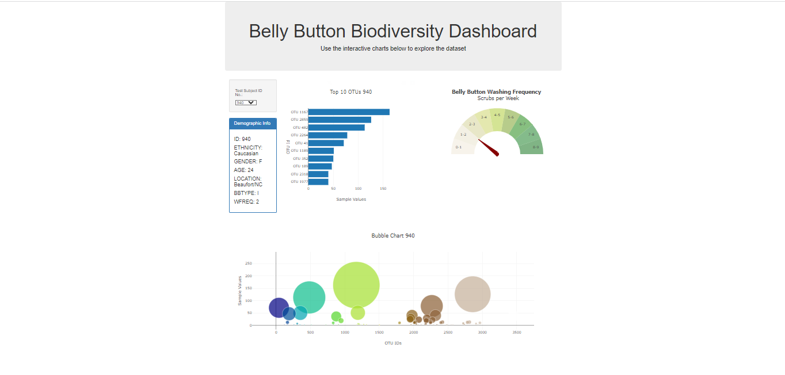

# belly_button_challenge
Creating an interactive dashboard to explore the Belly Button Biodiversity dataset, revealing prevalent and rare microbial species in human navels, and gaining valuable insights into this unique aspect of human biology.

"This challenge consists of 3 files:
- index.html
- samples.json
- a static folder contains a file named 'js', and inside the 'js' folder, there is a file named 'app.js' which has the JavaScript code.

## Instructions
For this challenge, I'll complete the following steps:
1: I'll use the D3 library to read in samples.json from the URL [(https://2u-data-curriculum-team.s3.amazonaws.com/dataviz-classroom/v1.1/14-Interactive-Web-Visualizations/02-Homework/samples.json)].

2: Then, I'll Create a horizontal bar chart with a dropdown menu to display the top 10 OTUs found in that individual.

- I'll use **sample_values** as the values for the bar chart.
- Use **otu_ids** as the labels for the bar chart.
- Use **otu_labels** as the hovertext for the chart.

 

3: Create a bubble chart that displays each sample.
- Use otu_ids for the x values.
- Use sample_values for the y values.
- Use sample_values for the marker size.
- Use otu_ids for the marker colors.
- Use otu_labels for the text values.

4: Then I'll display the sample metadata, i.e., an individual's demographic information.

5: Also, I'll display each key-value pair from the metadata JSON object somewhere on the page.

6: After that, I'll update all the plots when a new sample is selected. My dashboard is shown below:

7: Then, I'll deploy my app to a free static page hosting service, such as GitHub Pages.

Then, I'll create a Gauge chart:
- I'll A=sdapt the Gauge Chart from [(https://plot.ly/javascript/gauge-charts/)] to plot the weekly washing frequency of the individual.
- I'll need to modify the example gauge code to account for values ranging from 0 through 9.
- Then I'll update the chart whenever a new sample is selected.

***References***

Hulcr, J. et al. (2012) A Jungle in There: Bacteria in Belly Buttons are Highly Diverse, but Predictable. Retrieved from: [(http://robdunnlab.com/projects/belly-button-biodiversity/results-and-data/)].

